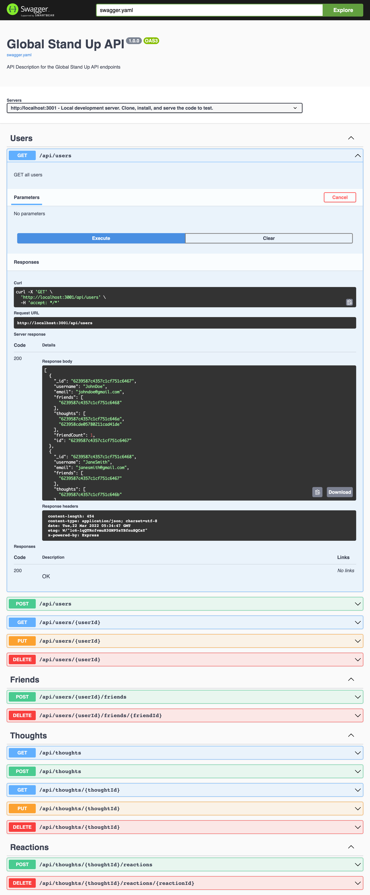

# 🌅 global-stand-up

A social media back end for collaboration built with NodeJS, Express, Mongoose, and MongoDB. Share what you're working on today.

View the Swagger API Docs and test the deployed API on Heroku here: https://global-stand-up.herokuapp.com/

## Prerequisites

- NodeJS
- MongoDB

## Libraries

- express
- mongoose
- [swagger-github-pages](https://github.com/peter-evans/swagger-github-pages)

## Setup

- `git clone git@github.com:jmichaelbrown8/global-stand-up.git`
- `cd global-stand-up`
- `npm i`
- `npm run dev`

## Deploy

This app is deployed to heroku and connected to a Mongo Atlas cloud database.

- Connect to MongoDB Atlas and create a database
- Add that connection string to the Heroku App's config vars as `MONGODB_URI`
- Deploy the app

